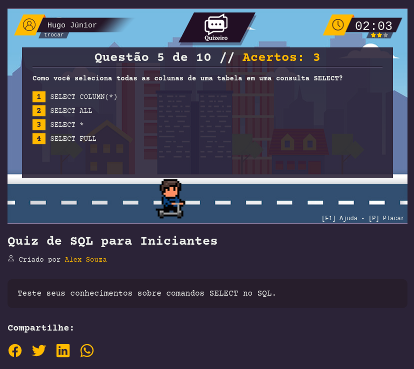

# Quizeiro
Quizeiro é uma plataforma gratuita que permite que os usuários criem seus próprios quizzes personalizados e os compartilhem com amigos.



## Vantagens
- Seguro
- Gratuito
- Divertido
- Placar Dinâmico
- Sem Propagandas
- Ativação Imediata
- Quizzes Ilimitados
- Relatórios Completo
- Links Compartilháveis
- Agendamento de Quiz
- Quizzes Públicos e Privados
- Integração com ChatGPT para Geração de Perguntas

## Estrutura do projeto
O projeto é dividido em três partes:
1. **Ambiente inicial** - O espaço onde você se familiariza com o projeto e pode criar sua conta.
2. **Ambiente administrativo** - O ponto de acesso onde você faz login e gerencia seus quizzes.
3. **Ambiente do quiz** - O espaço gerado ao criar um quiz, juntamente com o link a ser compartilhado para permitir a participação das pessoas.

## Regras de pontuação
O cálculo da pontuação é determinado pela quantidade de perguntas respondidas corretamente e pelo tempo restante. Assim, cada pergunta respondida corretamente adiciona 20 pontos proporcionalmente, enquanto cada segundo restante acrescenta 1 ponto.

## Instalação do projeto
O projeto roda usando o framework [Laravel](https://laravel.com/) e está configurado para ser executado usando [Docker](https://docs.docker.com/get-docker/). Portanto, é essencial ter o Docker instalado para que funcione corretamente.

> [!WARNING]
> **Observação:** Antes de executar o projeto, assegure-se de que as seguintes portas estejam disponíveis em sua máquina ou altere a configuração no arquivo [docker-composer.yml](docker-compose.yml): 80 (Nginx), 3306 (MySQL) e 6379 (Redis).

### Clonando o repositório
```bash
git clone git@github.com:hugojunior/quizeiro.git
```
### Entrando na pasta do projeto
```bash
cd quizeiro
```
### Definindo o arquivo com variáveis de ambiente
```bash
cp laravel/.env.example laravel/.env
```
### Rodando docker
```bash
docker compose --env-file laravel/.env up -d
```
### Acessando o container
```bash
docker compose --env-file laravel/.env exec quizeiro bash
```
### Dentro do container: Rodando composer (instalação de dependências)
```bash
cd laravel && composer install
```
### Dentro do container: Rodando migrations para criar a estrutura do banco de dados
```bash
php artisan migrate
```
Se todos os passos foram seguidos corretamente nessa ordem, você deve conseguir acessar a aplicação usando `http://localhost` ou `http://127.0.0.1`.

> [!INFO]
> **Sugestão:** Você pode configurar um domínio local no arquivo `/etc/hosts`. Exemplo: 127.0.0.1 quizeiro.local

## Contato e suporte
Qualquer dúvida sobre o projeto ou dificuldade em executar alguma das tarefas, você pode entrar em contato comigo através do [meu e-mail](mailto:contato@hugojunior.com).
